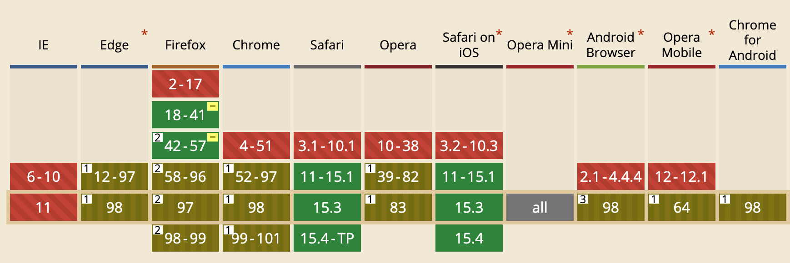

# 常用兼容性问题及解决办法.md


## `MediaDevices API` 兼容性问题


在还没有真正形成`MediaDevices API`前，一些浏览器已经在内部实现了媒体采集的API。

所以，当无法调用`navigator.mediaDevices.getUserMedia`时，不代表浏览器没有媒体采集的功能。例如在Chrome中，就可以通过`navigator.webkitGetUserMedia` 打开摄像头。


因此，处理`getUserMedia` 兼容性问题就是处理各家浏览器在内部实现到正式实现`MediaDevices API` 的问题。解决方法如下所示：


```javascript
function getUserMediaFn() {
  let fn = null
  const mediaDevices = navigator.mediaDevices || {}
  if (mediaDevices.getUserMedia) {
    fn = mediaDevices.getUserMedia.bind(mediaDevices)
  } else {
    const getUserMedia = navigator.webkitGetUserMedia || navigator.mozGetUserMedia
    if (getUserMedia) {
      fn = function(constraints) {
        return new Promise((resolve, reject) => {
          getUserMedia.call(navigator, constraints, resolve, reject)
        })
      }
    }
  }
  return fn
}
```


> 以上代码已在个人工具库tongpo中实现，请参考[https://github.com/shoppingzh/tongpo/blob/main/src/media.js](https://github.com/shoppingzh/tongpo/blob/main/src/media.js)


## `HTMLMediaElement.srcObject` 兼容性问题


`HTMLMediaElement` 是`<video>`与`<audio>` 的父类，其`srcObject` 属性支持设置为一个`MediaStream` 对象，以在视频或音频中渲染该媒体流。它的兼容性情况如下所示：



在不支持`srcObject` 的浏览器里，要通过将媒体流转换为播放URL的方式并设置`HTMLMediaElement` 的`src` 属性的方式来实现媒体流渲染。代码如下所示：


```javascript
function render(media, stream) {
  if ('srcObject' in media) {
    media.srcObject = stream
  } else {
    media.src = URL.createObjectURL(stream)
  }
}
```


> 以上代码已在个人工具库tongpo中实现，请参考[https://github.com/shoppingzh/tongpo/blob/main/src/media.js](https://github.com/shoppingzh/tongpo/blob/main/src/media.js)

